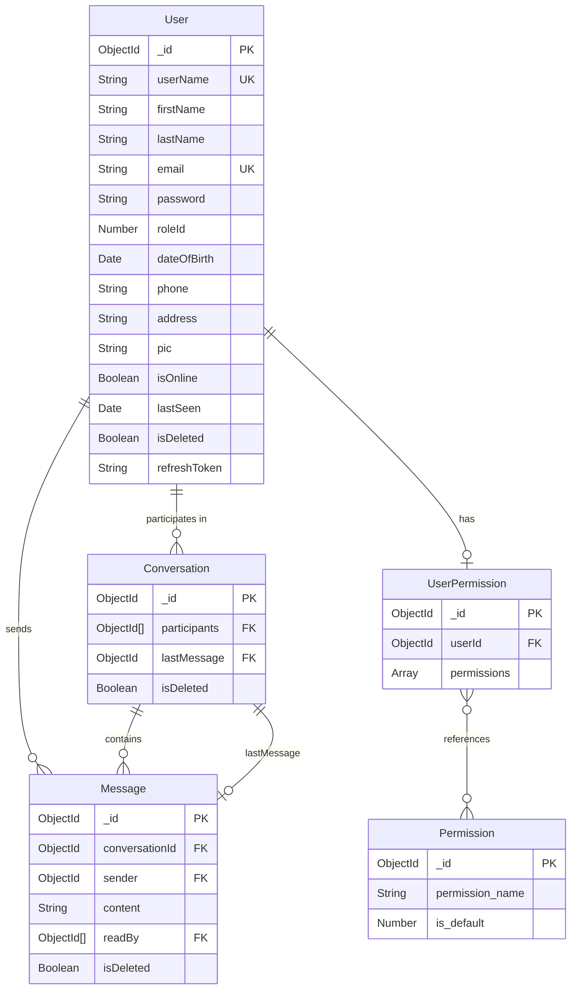
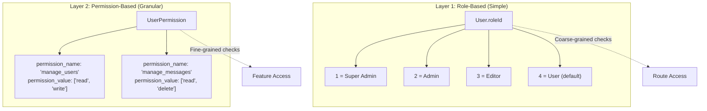
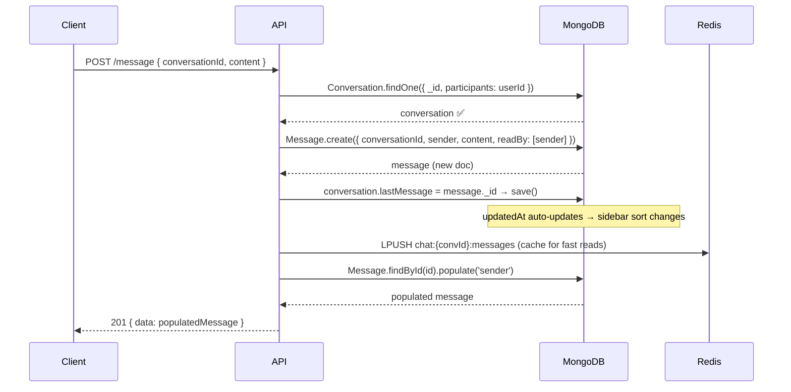

# Database Design — PTM Chat

## Overview

PTM Chat uses **MongoDB** (via **Mongoose ODM**) as its primary persistent data store. The database follows a **document-oriented design** with **5 collections** connected through ObjectId references. This design is optimized for a real-time chat application where conversation lookups, message pagination, and user presence are the most frequent operations.

**Connection:** [connection.js](file:///e:/PTM%20Chat/backend/src/db/connection.js) — connects via `MONGODB_URI` environment variable using Mongoose.

---

## Entity Relationship Diagram



---

## Collection Details

### 1. User

> **File:** [user-model.js](file:///e:/PTM%20Chat/backend/src/routes/user/user-model.js)

The central entity — every other collection references it.

| Field | Type | Required | Default | Description |
|---|---|---|---|---|
| `userName` | String | ✅ | — | Unique display name |
| `firstName` | String | ✅ | — | User's first name |
| `lastName` | String | ✅ | — | User's last name |
| `email` | String | ✅ (unique) | — | Login credential |
| `password` | String | ❌ | — | bcrypt-hashed password |
| `roleId` | Number | ❌ | `4` | 1: Super Admin, 2: Admin, 3: Editor, 4: User |
| `dateOfBirth` | Date | ❌ | — | Optional profile field |
| `phone` | String | ❌ | — | Optional profile field |
| `address` | String | ❌ | — | Optional profile field |
| `pic` | String | ❌ | `"no-user.jpg"` | Profile picture filename |
| `isOnline` | Boolean | ❌ | `false` | Real-time presence flag |
| `lastSeen` | Date | ❌ | `Date.now` | Last activity timestamp |
| `isDeleted` | Boolean | ❌ | `false` | Soft-delete flag |
| [refreshToken](file:///e:/PTM%20Chat/backend/src/routes/auth/auth-controller.js#155-189) | String | ❌ | `null` | JWT refresh token (rotated on each login) |

**Indexes:**

| Index | Fields | Purpose |
|---|---|---|
| Unique | `email` | Prevent duplicate accounts |
| Single-field | `isOnline` | Fast online-user queries |
| Single-field | `isDeleted` | Filter out deleted users |
| Compound | `{ isDeleted: 1, isOnline: 1 }` | Optimized query for "all active online users" |

**Timestamps:** `createdAt`, `updatedAt` (auto-managed by Mongoose)

#### Design Decisions

- **Soft delete** (`isDeleted`) — Users are never physically removed; historical messages and conversations remain intact.
- **`roleId` as Number** — Simple integer-based RBAC (role-based access control) rather than a separate roles collection, keeping lookups fast.
- **[refreshToken](file:///e:/PTM%20Chat/backend/src/routes/auth/auth-controller.js#155-189) stored in document** — Enables single-query token rotation validation (find by user ID + matching token).
- **`isOnline` / `lastSeen` in DB** — Acts as a fallback; Redis provides real-time presence, but the DB persists the last known state across server restarts.

---

### 2. Conversation

> **File:** [conversation-model.js](file:///e:/PTM%20Chat/backend/src/routes/conversation/conversation-model.js)

Represents a chat thread between two users (1-on-1 messaging).

| Field | Type | Required | Default | Description |
|---|---|---|---|---|
| `participants` | ObjectId[] | ✅ | — | Array of exactly 2 User references |
| `lastMessage` | ObjectId | ❌ | `null` | Reference to the most recent Message |
| `isDeleted` | Boolean | ❌ | `false` | Soft-delete flag |

**Indexes:**

| Index | Fields | Purpose |
|---|---|---|
| Single-field | `participants` | Fast lookup: "find all conversations for user X" |
| Single-field | `updatedAt: -1` | Sidebar sorting — most recently active conversations first |

**Timestamps:** `createdAt`, `updatedAt`

#### Design Decisions

- **`lastMessage` denormalization** — Instead of querying Messages to find the latest, the conversation stores a direct reference. This makes the sidebar (which shows last message previews) a single query with `.populate('lastMessage')` instead of N+1 queries.
- **`participants` as array** — Enables the `{ $all: [userId1, userId2] }` query pattern to find or create conversations between two specific users. The [createOrGetConversation](file:///e:/PTM%20Chat/backend/src/routes/conversation/conversation-controller.js#L5) controller uses this to prevent duplicate conversations.
- **`updatedAt` index descending** — Conversations are sorted by recency in the sidebar; Mongoose auto-updates `updatedAt` whenever `conversation.save()` is called (e.g., after a new message sets `lastMessage`).

#### Key Query Patterns

```javascript
// Find existing conversation between two users
Conversation.findOne({
    participants: { $all: [userId, participantId] },
    isDeleted: false
})

// Get user's sidebar (all conversations, sorted by recent activity)
Conversation.find({ participants: userId, isDeleted: false })
    .populate('participants', 'userName firstName lastName pic isOnline lastSeen')
    .populate({ path: 'lastMessage', select: 'content sender createdAt readBy' })
    .sort({ updatedAt: -1 })
```

---

### 3. Message

> **File:** [message-model.js](file:///e:/PTM%20Chat/backend/src/routes/message/message-model.js)

Individual chat messages within a conversation. The highest-volume collection.

| Field | Type | Required | Default | Description |
|---|---|---|---|---|
| `conversationId` | ObjectId | ✅ | — | Parent conversation reference |
| `sender` | ObjectId | ✅ | — | User who sent the message |
| `content` | String | ✅ | — | Message text (trimmed) |
| `readBy` | ObjectId[] | ❌ | — | Users who have read this message |
| `isDeleted` | Boolean | ❌ | `false` | Soft-delete flag |

**Indexes:**

| Index | Fields | Purpose |
|---|---|---|
| Single-field | `conversationId` | Filter messages by conversation |
| Compound | `{ conversationId: 1, createdAt: -1 }` | **Critical** — powers paginated chat history (newest first) |

**Timestamps:** `createdAt`, `updatedAt`

#### Design Decisions

- **Compound index `{ conversationId, createdAt: -1 }`** — This is the most important index in the system. Every time a user opens a chat, MongoDB runs `Message.find({ conversationId }).sort({ createdAt: -1 }).skip(n).limit(30)`. Without this compound index, MongoDB would need to scan all messages and sort in memory.
- **`readBy` as array** — Tracks which participants have read each message. In a 1-on-1 chat, when `readBy` contains both participants, the message is "read". This scales to group chats if needed.
- **`content` with `trim: true`** — Mongoose-level validation prevents whitespace-only messages from being stored.
- **Sender stored as reference** — Populated with `'userName firstName lastName pic'` on read to display in the UI.

#### Key Query Patterns

```javascript
// Paginated message history (covered by compound index)
Message.find({ conversationId, isDeleted: false })
    .populate('sender', 'userName firstName lastName pic')
    .sort({ createdAt: -1 })
    .skip((page - 1) * limit)
    .limit(limit)

// Mark messages as read (bulk update)
Message.updateMany(
    { _id: { $in: messageIds }, readBy: { $nin: [userId] } },
    { $addToSet: { readBy: userId } }
)

// Mark all unread in conversation as read
Message.updateMany(
    { conversationId, sender: { $ne: userId }, readBy: { $nin: [userId] } },
    { $addToSet: { readBy: userId } }
)
```

---

### 4. Permission

> **File:** [permission-model.js](file:///e:/PTM%20Chat/backend/src/routes/permission/permission-model.js)

Defines granular permissions that can be assigned to users.

| Field | Type | Required | Default | Description |
|---|---|---|---|---|
| `permission_name` | String | ✅ | — | Permission identifier (e.g., `"manage_users"`) |
| `is_default` | Number | ❌ | `0` | Whether this permission is assigned by default (0 = no, 1 = yes) |

> [!NOTE]
> This is a lookup/reference table. It defines **what permissions exist** in the system. The actual user-to-permission mapping is in `UserPermission`.

---

### 5. UserPermission

> **File:** [user-permission-model.js](file:///e:/PTM%20Chat/backend/src/routes/user-permission/user-permission-model.js)

Maps users to their specific permissions with granular action control.

| Field | Type | Required | Default | Description |
|---|---|---|---|---|
| `userId` | ObjectId | ✅ | — | Reference to User |
| `permissions` | Array | ❌ | — | Array of permission objects |
| `permissions[].permission_name` | String | — | — | Name of the permission |
| `permissions[].permission_value` | String[] | — | — | Allowed actions (e.g., `["read", "write", "delete"]`) |

#### Design Decision

- **Embedded permission array** — Rather than a separate junction table per permission, all of a user's permissions are stored in a single document. This means fetching a user's full permission set is a **single query** (`UserPermission.findOne({ userId })`), not a join across tables.

---

## Authorization Architecture

The system uses a **two-layer authorization model**:



| Layer | Stored In | Checked By | Use Case |
|---|---|---|---|
| **Role** | `User.roleId` | JWT payload (`decoded.roleId`) | Broad access control (admin vs. user) |
| **Permission** | `UserPermission` collection | Middleware lookup | Fine-grained feature toggles |

---

## Data Flow: Sending a Message

This diagram shows how all collections interact during the most common operation:



---

## Indexing Strategy Summary

| Collection | Index | Type | Query It Supports |
|---|---|---|---|
| [User](file:///e:/PTM%20Chat/backend/src/routes/user/user-controller.js#203-243) | `email` | Unique | Login, registration duplicate check |
| [User](file:///e:/PTM%20Chat/backend/src/routes/user/user-controller.js#203-243) | `isOnline` | Single | Online users list |
| [User](file:///e:/PTM%20Chat/backend/src/routes/user/user-controller.js#203-243) | `isDeleted` | Single | Active user filtering |
| [User](file:///e:/PTM%20Chat/backend/src/routes/user/user-controller.js#203-243) | `{ isDeleted, isOnline }` | Compound | "All active & online users" |
| [Conversation](file:///e:/PTM%20Chat/backend/src/routes/conversation/conversation-controller.js#50-71) | `participants` | Single | Find conversations for a user |
| [Conversation](file:///e:/PTM%20Chat/backend/src/routes/conversation/conversation-controller.js#50-71) | `updatedAt: -1` | Single | Sidebar sorting (most recent first) |
| [Message](file:///e:/PTM%20Chat/backend/src/routes/message/message-controller.js#63-131) | `conversationId` | Single | Filter by conversation |
| [Message](file:///e:/PTM%20Chat/backend/src/routes/message/message-controller.js#63-131) | `{ conversationId, createdAt: -1 }` | Compound | Paginated chat history |

> [!TIP]
> The **compound index on Message** is the single most performance-critical index. It turns the most frequent query (loading chat history) from a collection scan + in-memory sort into a direct B-tree traversal.

---

## Design Patterns Used

| Pattern | Where | Why |
|---|---|---|
| **Soft Delete** | All collections (`isDeleted`) | Preserves data integrity; enables undo; audit trail |
| **Denormalization** | `Conversation.lastMessage` | Avoids expensive aggregation to find latest message per conversation |
| **Reference + Populate** | `Message.sender`, `Conversation.participants` | Keeps documents small; populates on read with selected fields |
| **Embedded Subdocuments** | `UserPermission.permissions[]` | Single-document reads for all user permissions |
| **Timestamps** | All collections | Automatic `createdAt` / `updatedAt` for ordering and auditing |
| **Array of References** | `Message.readBy`, `Conversation.participants` | Models many-to-many without junction collections |

---

## MongoDB + Redis: How They Work Together

| Data | MongoDB Role | Redis Role |
|---|---|---|
| **Messages** | Source of truth; paginated history | Cache for last 50 messages (1-hr TTL) |
| **Online status** | Persisted `isOnline` / `lastSeen` | Real-time `online_users` Set |
| **Socket sessions** | — | `socket_sessions` Hash (userId → socketId) |
| **Auth tokens** | [refreshToken](file:///e:/PTM%20Chat/backend/src/routes/auth/auth-controller.js#155-189) stored in User doc | Blacklisted access tokens (`bl:*` keys) |
| **Rate limits** | — | INCR counters with TTL windows |

> [!IMPORTANT]
> MongoDB is the **source of truth** for all persistent data. Redis holds **derived, ephemeral, or speed-critical** copies. If Redis is flushed, the system recovers naturally — presence rebuilds on reconnect, caches repopulate on read, and auth continues working (blacklisted tokens become valid until they expire, but this is a brief window).

---

## Files Reference

| File | Purpose |
|---|---|
| [connection.js](file:///e:/PTM%20Chat/backend/src/db/connection.js) | MongoDB connection via Mongoose |
| [user-model.js](file:///e:/PTM%20Chat/backend/src/routes/user/user-model.js) | User schema + indexes |
| [conversation-model.js](file:///e:/PTM%20Chat/backend/src/routes/conversation/conversation-model.js) | Conversation schema + indexes |
| [message-model.js](file:///e:/PTM%20Chat/backend/src/routes/message/message-model.js) | Message schema + compound index |
| [permission-model.js](file:///e:/PTM%20Chat/backend/src/routes/permission/permission-model.js) | Permission definitions |
| [user-permission-model.js](file:///e:/PTM%20Chat/backend/src/routes/user-permission/user-permission-model.js) | User ↔ Permission mapping |
