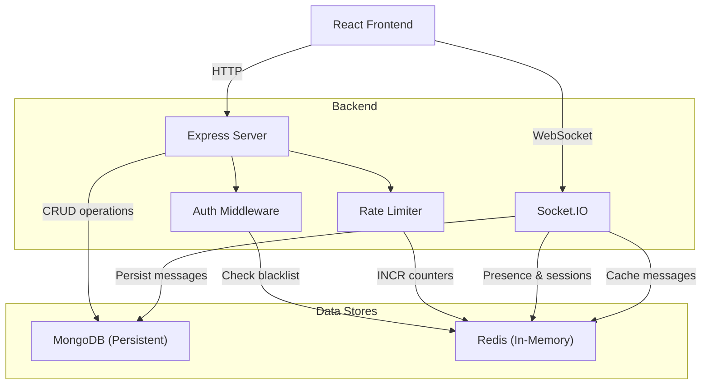
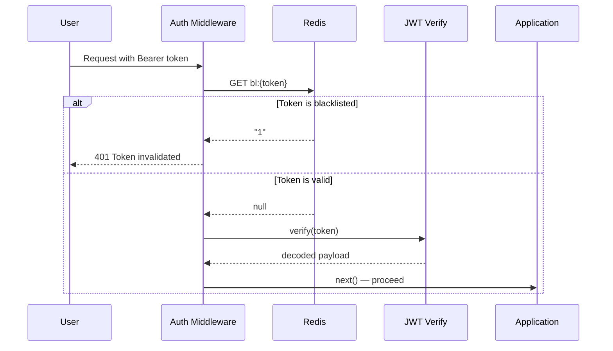
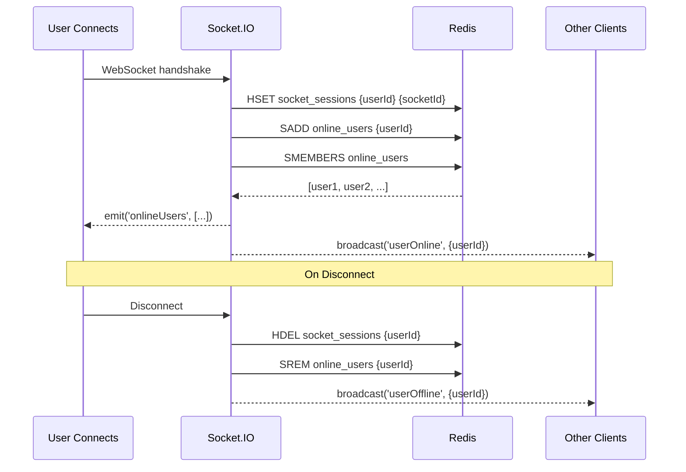
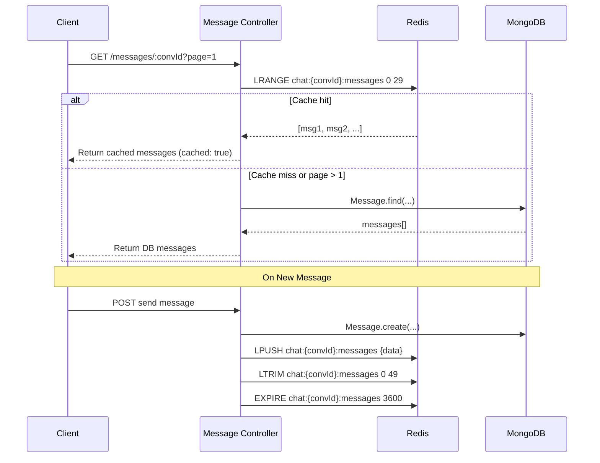
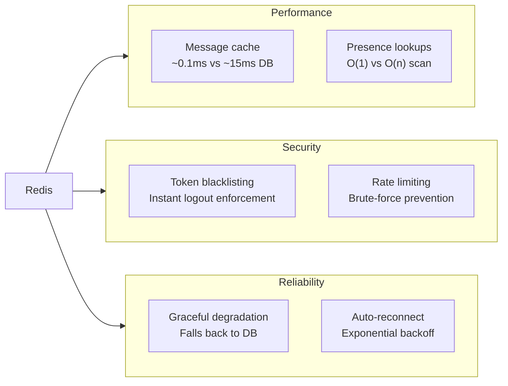

# Redis Implementation — PTM Chat

## Overview

PTM Chat uses **Redis** (via the `ioredis` npm package) as an **in-memory data store** that sits alongside MongoDB to handle high-speed, ephemeral, and frequently-accessed data. While MongoDB serves as the persistent source of truth, Redis is used for operations where **sub-millisecond latency** matters — real-time presence, security enforcement, message caching, and abuse prevention.

---

## Why Redis?

| Challenge | Without Redis | With Redis |
|---|---|---|
| **Logout security** | Tokens remain valid until expiry; server cannot revoke them | Blacklisted tokens are checked in microseconds |
| **Online status** | Requires a DB query per user per check | O(1) set lookups, instant broadcast |
| **Recent messages** | Every page-1 load hits MongoDB | Served from RAM cache — near-zero latency |
| **Rate limiting** | Needs a DB counter table or in-memory map (lost on restart) | Atomic `INCR` with auto-expiring keys |
| **Socket routing** | No way to find which socket belongs to which user | Hash map lookup in constant time |

> [!IMPORTANT]
> Redis is **not** a replacement for MongoDB in this project. It is a complementary layer for **speed-critical, short-lived data**. If Redis goes down, the app degrades gracefully — requests fall through to MongoDB, and rate limiting is temporarily bypassed.

---

## Architecture



---

## Client Configuration

> **File:** [redis.js](file:///e:/PTM%20Chat/backend/src/config/redis.js)

```javascript
import Redis from 'ioredis';

const redisClient = new Redis(process.env.REDIS_URL || 'redis://localhost:6379', {
    maxRetriesPerRequest: 3,
    retryStrategy(times) {
        const delay = Math.min(times * 50, 2000);
        return delay;
    },
    reconnectOnError(err) {
        const targetError = 'READONLY';
        if (err.message.includes(targetError)) {
            return true;
        }
        return false;
    }
});
```

| Setting | Value | Purpose |
|---|---|---|
| `maxRetriesPerRequest` | `3` | Fails fast if Redis is unreachable — prevents request hang |
| [retryStrategy](file:///e:/PTM%20Chat/backend/src/config/redis.js#5-9) | Exponential backoff, capped at 2 s | Reconnects progressively without flooding |
| [reconnectOnError](file:///e:/PTM%20Chat/backend/src/config/redis.js#9-16) | Reconnect on `READONLY` | Handles Redis failover (replica promoted to primary) |

A **singleton pattern** is used — the same `redisClient` instance is imported by every module, ensuring a single persistent connection.

---

## Use-Case 1 — JWT Token Blacklisting (Secure Logout)

### The Problem

JWTs are **stateless** — once issued, they're valid until expiry. If a user logs out, the token could still be used by an attacker until it naturally expires (1 day in this app).

### The Solution

On logout, the token is stored in Redis with a TTL equal to its remaining validity. Every authenticated request checks Redis first.



### Implementation Details

**Blacklisting on logout** — [auth-controller.js](file:///e:/PTM%20Chat/backend/src/routes/auth/auth-controller.js):

```javascript
// Decode token to get expiry, calculate remaining TTL
const decoded = jwt.decode(token);
const ttl = decoded.exp - Math.floor(Date.now() / 1000);
if (ttl > 0) {
    await redisClient.setex(`bl:${token}`, ttl, '1');
}
```

- **Key format:** `bl:<full_jwt_token>`
- **Value:** `"1"` (simple flag)
- **TTL:** Remaining seconds until the JWT would naturally expire
- **Why TTL?** The entry auto-deletes once the token would have expired anyway — no cleanup needed.

**Checking on every request** — [auth-middleware.js](file:///e:/PTM%20Chat/backend/src/middleware/auth-middleware.js):

```javascript
const isBlacklisted = await redisClient.get(`bl:${token}`);
if (isBlacklisted) {
    return res.status(401).json({ message: 'Token has been invalidated' });
}
```

**Also checked on WebSocket connection** — [socket.js](file:///e:/PTM%20Chat/backend/src/socket/socket.js#L16-L20):

```javascript
const isBlacklisted = await redisClient.get(`bl:${token}`);
if (isBlacklisted) {
    return next(new Error('Token has been invalidated'));
}
```

### Redis Data Structure

| Structure | Key Pattern | Value | TTL |
|---|---|---|---|
| String | `bl:<jwt_token>` | `"1"` | Remaining token lifetime |

### Why Redis Helps Here

- **O(1) lookup** — checking a key is instant, regardless of how many tokens are blacklisted
- **Auto-cleanup** — TTL ensures expired tokens don't accumulate
- **Both HTTP and WebSocket** are protected with the same mechanism

---

## Use-Case 2 — Online Presence & Socket Session Mapping

### The Problem

The app needs to know which users are online in real-time and route messages to specific socket connections. Querying MongoDB for every presence check would be too slow.

### The Solution

Redis maintains two data structures:
1. **Set** (`online_users`) — stores all currently online user IDs
2. **Hash** (`socket_sessions`) — maps each user ID to their socket ID



### Implementation Details

**On connection** — [socket.js](file:///e:/PTM%20Chat/backend/src/socket/socket.js#L40-L52):

```javascript
await redisClient.hset('socket_sessions', userId, socket.id);
await redisClient.sadd('online_users', userId);

const onlineUsers = await redisClient.smembers('online_users');
socket.emit('onlineUsers', onlineUsers);
```

**On disconnect** — [socket.js](file:///e:/PTM%20Chat/backend/src/socket/socket.js#L176-L178):

```javascript
await redisClient.hdel('socket_sessions', userId);
await redisClient.srem('online_users', userId);
```

**Routing to specific sockets** — [socket.js](file:///e:/PTM%20Chat/backend/src/socket/socket.js#L118):

```javascript
const otherSocketId = await redisClient.hget('socket_sessions', otherParticipantId);
if (otherSocketId) {
    io.to(otherSocketId).emit('conversationUpdated', { ... });
}
```

**Also cleaned on logout** — [auth-controller.js](file:///e:/PTM%20Chat/backend/src/routes/auth/auth-controller.js#L147):

```javascript
await redisClient.srem('online_users', req.user._id.toString());
```

### Redis Data Structures

| Structure | Key | Field/Member | Value |
|---|---|---|---|
| Hash | `socket_sessions` | `<userId>` | `<socketId>` |
| Set | `online_users` | `<userId>` | — |

### Why Redis Helps Here

- **O(1)** add/remove/check operations on Sets and Hashes
- **No persistence needed** — if Redis restarts, users simply reconnect
- **SMEMBERS** returns the full online list in one call — no DB scan required
- Socket session mapping enables **targeted message delivery** without broadcasting

---

## Use-Case 3 — Message Caching

### The Problem

When a user opens a conversation, they see the most recent messages. Without caching, every conversation open triggers a full MongoDB query with sorting, population, and pagination.

### The Solution

The **last 50 messages** per conversation are cached in a Redis List. Page 1 requests are served from cache; older pages fall through to MongoDB.



### Implementation Details

**Writing to cache** — [message-controller.js](file:///e:/PTM%20Chat/backend/src/routes/message/message-controller.js#L37-L50):

```javascript
const cacheKey = `chat:${conversationId}:messages`;
const messageData = JSON.stringify({
    _id: message._id,
    conversationId,
    sender: senderId,
    content: message.content,
    readBy: message.readBy,
    createdAt: message.createdAt
});

await redisClient.lpush(cacheKey, messageData);   // Push to front
await redisClient.ltrim(cacheKey, 0, 49);          // Keep max 50
await redisClient.expire(cacheKey, 3600);           // 1-hour TTL
```

**Reading from cache** — [message-controller.js](file:///e:/PTM%20Chat/backend/src/routes/message/message-controller.js#L81-L103):

```javascript
if (page === 1) {
    const cachedMessages = await redisClient.lrange(
        `chat:${conversationId}:messages`, 0, limit - 1
    );
    if (cachedMessages && cachedMessages.length > 0) {
        const parsed = cachedMessages.map(m => JSON.parse(m));
        return res.status(200).json({
            data: parsed,
            cached: true
        });
    }
}
// Falls through to MongoDB if cache miss or page > 1
```

**Also cached via WebSocket** — The same caching logic exists in [socket.js](file:///e:/PTM%20Chat/backend/src/socket/socket.js#L91-L103) for real-time messages sent through Socket.IO.

### Redis Data Structure

| Structure | Key Pattern | Value | TTL |
|---|---|---|---|
| List | `chat:<conversationId>:messages` | JSON-stringified message objects | 3600 s (1 hour) |

### Strategy Decisions

| Decision | Choice | Reason |
|---|---|---|
| Cache only page 1 | ✅ | 90%+ of reads are recent messages |
| `LTRIM` to 50 | ✅ | Caps memory usage per conversation |
| 1-hour TTL | ✅ | Stale chats auto-evict; active ones keep refreshing |
| `LPUSH` (prepend) | ✅ | Newest messages at index 0, natural sort for `LRANGE` |

---

## Use-Case 4 — Rate Limiting

### The Problem

Without rate limiting, a malicious user could:
- Brute-force login credentials
- Flood the chat with messages
- Overload the server with API requests

### The Solution

A **configurable, Redis-based rate limiter** using atomic `INCR` with TTL-based sliding windows.

### Implementation Details

[rate-limiter.js](file:///e:/PTM%20Chat/backend/src/middleware/rate-limiter.js):

```javascript
export const rateLimiter = ({ windowMs = 60000, max = 10, keyPrefix = 'rl' }) => {
    return async (req, res, next) => {
        const identifier = req.ip || req.connection.remoteAddress;
        const key = `${keyPrefix}:${identifier}`;
        const windowSeconds = Math.ceil(windowMs / 1000);

        const current = await redisClient.incr(key);       // Atomic increment

        if (current === 1) {
            await redisClient.expire(key, windowSeconds);   // Set window on first hit
        }

        if (current > max) {
            const ttl = await redisClient.ttl(key);
            return res.status(429).json({
                message: 'Too many requests',
                retryAfter: ttl
            });
        }

        res.set({
            'X-RateLimit-Limit': max,
            'X-RateLimit-Remaining': Math.max(0, max - current),
            'X-RateLimit-Reset': Math.ceil(Date.now() / 1000) + (await redisClient.ttl(key))
        });

        next();
    };
};
```

**Pre-configured limiters:**

| Limiter | Window | Max Requests | Applied To |
|---|---|---|---|
| `loginLimiter` | 1 minute | 5 | `/auth/login` |
| `messageLimiter` | 10 seconds | 20 | `/message/send` |

### Redis Data Structure

| Structure | Key Pattern | Value | TTL |
|---|---|---|---|
| String (counter) | `rl:<prefix>:<ip_address>` | Incrementing integer | `windowSeconds` |

### Graceful Degradation

```javascript
catch (error) {
    // If Redis is down, allow the request through
    console.error('Rate limiter error:', error.message);
    next();
}
```

> [!TIP]
> If Redis goes down, rate limiting is **bypassed** rather than blocking all requests. This is a conscious trade-off — availability over strict enforcement during outages.

---

## Summary of All Redis Keys

| Key Pattern | Type | Purpose | TTL | Module |
|---|---|---|---|---|
| `bl:<jwt_token>` | String | Blacklisted JWT tokens | Token's remaining lifetime | Auth |
| `online_users` | Set | All currently online user IDs | None (managed manually) | Socket |
| `socket_sessions` | Hash | userId → socketId mapping | None (managed manually) | Socket |
| `chat:<convId>:messages` | List | Cached recent messages (max 50) | 1 hour | Messages |
| `rl:login:<ip>` | String | Login attempt counter | 60 seconds | Rate Limiter |
| `rl:message:<ip>` | String | Message send counter | 10 seconds | Rate Limiter |

---

## System Benefits Summary



| Benefit | Impact |
|---|---|
| **Faster response times** | Message loads and presence checks are served from RAM |
| **Real-time accuracy** | Online status updates propagate in milliseconds |
| **True logout** | Blacklisted tokens are rejected immediately across HTTP and WebSocket |
| **Abuse prevention** | Brute-force and spam attacks are blocked at the middleware level |
| **Memory-efficient** | TTLs and `LTRIM` prevent unbounded growth |
| **Fault-tolerant** | Every Redis call has a fallback path — the app never crashes if Redis is down |

---

## Files Involved

| File | Redis Usage |
|---|---|
| [redis.js](file:///e:/PTM%20Chat/backend/src/config/redis.js) | Client singleton with retry/reconnect config |
| [auth-controller.js](file:///e:/PTM%20Chat/backend/src/routes/auth/auth-controller.js) | `SETEX` for blacklisting, `SREM` for logout presence cleanup |
| [auth-middleware.js](file:///e:/PTM%20Chat/backend/src/middleware/auth-middleware.js) | `GET` for blacklist check on every HTTP request |
| [socket.js](file:///e:/PTM%20Chat/backend/src/socket/socket.js) | `HSET/HDEL/HGET` for sessions, `SADD/SREM/SMEMBERS` for presence, `LPUSH/LTRIM/EXPIRE` for message cache, `GET` for blacklist on WebSocket auth |
| [message-controller.js](file:///e:/PTM%20Chat/backend/src/routes/message/message-controller.js) | `LPUSH/LTRIM/EXPIRE` for write-through cache, `LRANGE` for cache reads |
| [rate-limiter.js](file:///e:/PTM%20Chat/backend/src/middleware/rate-limiter.js) | `INCR/EXPIRE/TTL` for sliding-window counters |
