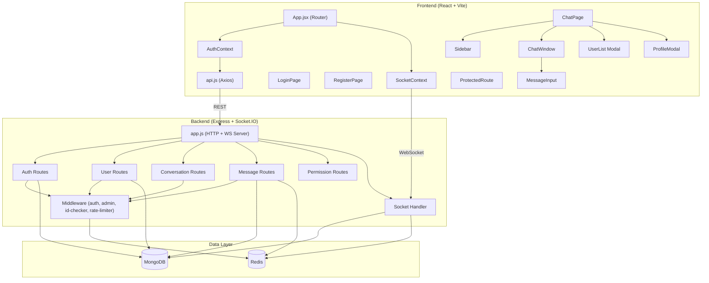

# PTM Chat — Complete Code Review & Flow Walkthrough

## Project Overview

PTM Chat is a **real-time 1-on-1 chat application** built with a **Node.js/Express backend** and a **React (Vite) frontend**, backed by **MongoDB** for persistence, **Redis** for caching/presence/rate-limiting, and **Socket.IO** for real-time communication.

---

## Architecture Diagram



---

## Data Models

| Model | Key Fields | Purpose |
|-------|-----------|---------|
| **User** | `userName`, `firstName`, `lastName`, `email`, `password`, `roleId` (1-4), `pic`, [isOnline](file:///e:/PTM%20Chat/frontend/src/components/UserList.jsx#37-38), `lastSeen`, `isDeleted`, [refreshToken](file:///e:/PTM%20Chat/backend/src/routes/auth/auth-controller.js#156-190) | User accounts with soft-delete & online presence |
| **Conversation** | `participants[]` (User refs), `lastMessage` (Message ref), `isDeleted` | 1-on-1 chat threads |
| **Message** | `conversationId`, `sender`, `content`, `readBy[]`, `isDeleted` | Individual messages with read receipts |
| **Permission** | `permission_name`, `is_default` | Permission definitions (admin feature) |
| **UserPermission** | `userId`, `permissions[{name, value[]}]` | Per-user permission assignments (model only, no routes) |

---

## Complete Application Flow

### 1. Startup & Infrastructure

```
docker-compose.yml → spins up MongoDB, Mongo Express, Redis, Redis Insight
app.js → creates Express app + HTTP server + Socket.IO server
       → connects to MongoDB (connection.js)
       → initializes Socket.IO handlers (socket.js)
       → registers middleware (cors, json, cookie-parser, static files)
       → mounts route modules at /auth, /user, /permission, /conversation, /message
```

### 2. Authentication Flow

```
Register: POST /auth/register
  → validates fields → checks duplicate email/username
  → bcrypt hashes password → creates User → generates JWT access (1d) + refresh (7d) tokens
  → saves refresh token in DB → returns user data + tokens

Login: POST /auth/login (rate-limited: 5/min)
  → validates credentials → bcrypt.compare → generates new token pair
  → saves refresh token → returns user data + tokens

Logout: POST /auth/logout (requires auth)
  → blacklists access token in Redis (bl:{token}) with matching TTL
  → clears refresh token in DB → sets user offline → removes from Redis online set

Token Refresh: POST /auth/refresh
  → verifies refresh token → matches against DB → rotates both tokens
```

### 3. Frontend Auth Flow

```
main.jsx → App.jsx (BrowserRouter)
  → AuthProvider (restores token/user from localStorage)
    → SocketProvider (connects Socket.IO when authenticated)
      → Routes:
          /login  → LoginPage (redirects to /chat if already authed)
          /register → RegisterPage (same redirect logic)
          /chat   → ProtectedRoute → ChatPage (redirects to /login if not authed)
          /*      → redirects to /chat
```

**API Layer** ([api.js](file:///e:/PTM%20Chat/frontend/src/utils/api.js)):
- Request interceptor attaches `Bearer {token}` from localStorage
- Response interceptor on 401: attempts token refresh → retries request, or clears storage and redirects to `/login`

### 4. Real-Time Socket Flow

**Connection** (when user authenticates):
```
SocketContext creates socket → sends token in handshake
  ↓
Server socket middleware (socket.js):
  → verifies JWT → checks Redis blacklist → loads user from DB
  → attaches userId to socket
  ↓
On connection:
  → Redis: HSET socket_sessions {userId → socketId}
  → Redis: SADD online_users {userId}
  → DB: User.isOnline = true
  → broadcasts 'userOnline' to all
  → sends current 'onlineUsers' list to this client
```

**Messaging Flow**:
```
MessageInput → emits 'sendMessage' {conversationId, content}
  ↓
Server socket handler:
  → verifies user is participant of conversation
  → creates Message in MongoDB (readBy: [sender])
  → updates Conversation.lastMessage
  → caches message in Redis list (chat:{convId}:messages, max 50, 1h TTL)
  → populates sender info → emits 'newMessage' to conversation room
  → also emits 'conversationUpdated' to other participant's socket (sidebar update)
  ↓
ChatWindow receives 'newMessage' → appends to messages array (with dedup)
ChatPage receives 'conversationUpdated' → updates sidebar conversation order
```

**Typing Indicators**:
```
MessageInput typing → emits 'typing' → server relays 'userTyping' to room
2s of inactivity  → emits 'stopTyping' → server relays 'userStopTyping'
ChatWindow listens → shows/hides typing bubble
```

**Read Receipts**:
```
ChatWindow detects unread messages → emits 'messageRead' {conversationId, messageIds}
  ↓
Server socket handler:
  → Message.updateMany($addToSet readBy) in MongoDB
  → Redis: DEL chat:{convId}:messages (invalidate cache so next fetch has fresh readBy)
  → io.to(room).emit('messagesRead') to ALL participants (including reader)
  ↓
ChatPage receives 'messagesRead' → updates readBy in local message state
ChatWindow → updates message status icons (single check → double check)

Also available via REST: PUT /message/read/:conversationId
  → updates readBy in MongoDB → invalidates Redis cache
```

**Disconnection**:
```
Socket disconnect → Redis: remove from socket_sessions + online_users
                  → DB: User.isOnline = false, lastSeen = now
                  → broadcasts 'userOffline'
```

### 5. REST API Endpoints

| Method | Route | Auth | Middleware | Purpose |
|--------|-------|------|------------|---------|
| POST | `/auth/register` | No | — | Create account |
| POST | `/auth/login` | No | loginLimiter | Sign in |
| POST | `/auth/logout` | Yes | — | Sign out + blacklist token |
| POST | `/auth/refresh` | No | — | Rotate tokens |
| GET | `/auth/profile` | Yes | — | Get profile |
| PUT | `/auth/profile` | Yes | — | Update profile (sanitized) |
| PUT | `/auth/change-password` | Yes | — | Change password |
| GET | `/user/getAllUsers` | Yes | — | Paginated user list with search |
| GET | `/user/getUserById/:id` | Yes | idChecker | Single user |
| POST | `/user/addUser` | Yes | multer | Admin create user |
| PUT | `/user/updateUser/:id` | Yes | idChecker, multer | Admin update user |
| DELETE | `/user/deleteUser/:id` | Yes | idChecker | Soft delete |
| POST | `/conversation` | Yes | — | Create or get existing conversation |
| GET | `/conversation` | Yes | — | List user's conversations |
| POST | `/message` | Yes | messageLimiter | Send message (REST fallback) |
| GET | `/message/:conversationId` | Yes | — | Paginated message history |
| PUT | `/message/read/:conversationId` | Yes | — | Mark messages as read |
| POST | `/permission/addPermission` | Yes | — | Create permission |
| GET | `/permission/getPermission` | Yes | admin | List permissions |
| PUT | `/permission/updatePermission/:id` | Yes | idChecker | Update permission |
| DELETE | `/permission/deletePermission/:id` | Yes | idChecker | Delete permission |

### 6. Redis Usage Summary

| Redis Key Pattern | Data Structure | Purpose |
|-------------------|---------------|---------|
| `bl:{token}` | String | JWT blacklist on logout (TTL = token expiry) |
| `socket_sessions` | Hash | userId → socketId mapping for targeted emits |
| `online_users` | Set | Currently connected user IDs |
| `chat:{convId}:messages` | List | Cached last 50 messages per conversation (1h TTL, invalidated on read receipts) |
| `rl:login:{ip}` | Counter | Login rate limiter (5 req/min) |
| `rl:message:{ip}` | Counter | Message rate limiter (20 req/10s) |

### 7. Middleware Pipeline

| Middleware | File | Purpose |
|-----------|------|---------|
| [token_middleware](file:///e:/PTM%20Chat/backend/src/middleware/auth-middleware.js#5-36) | [auth-middleware.js](file:///e:/PTM%20Chat/backend/src/middleware/auth-middleware.js) | Extracts JWT from `Authorization` header, checks Redis blacklist, verifies, loads user |
| [admin_middleware](file:///e:/PTM%20Chat/backend/src/middleware/admin-middleware.js#1-12) | [admin-middleware.js](file:///e:/PTM%20Chat/backend/src/middleware/admin-middleware.js) | Checks `req.user.roleId === 1` |
| [id_checker_middleware](file:///e:/PTM%20Chat/backend/src/middleware/id-checker-middleware.js#1-15) | [id-checker-middleware.js](file:///e:/PTM%20Chat/backend/src/middleware/id-checker-middleware.js) | Validates MongoDB ObjectId format (24 chars) |
| [rateLimiter](file:///e:/PTM%20Chat/backend/src/middleware/rate-limiter.js#3-47) | [rate-limiter.js](file:///e:/PTM%20Chat/backend/src/middleware/rate-limiter.js) | Redis-based sliding window rate limiter with `X-RateLimit-*` headers |

### 8. Frontend Component Hierarchy

```
ChatPage
├── Sidebar
│   ├── Conversation list (with online dots, last message preview, timestamps)
│   ├── "New Chat" button → opens UserList
│   └── User profile footer → opens ProfileModal
├── ChatWindow
│   ├── Header (avatar, name, online/typing status, last seen)
│   ├── Messages area (date separators, sent/received bubbles, read receipts, scroll pagination)
│   ├── Typing indicator (animated dots)
│   └── MessageInput (text input + send button + typing emission)
├── UserList (modal overlay — search + select user to start conversation)
└── ProfileModal (modal overlay — edit profile / change password, tabbed)
```

### 9. Services

| Service | File | Purpose |
|---------|------|---------|
| **Multer** | [multer-service.js](file:///e:/PTM%20Chat/backend/src/services/multer-service.js) | File upload to `./public/profileImage/` with timestamped filenames |
| **Sanitize** | [sanitize-service.js](file:///e:/PTM%20Chat/backend/src/services/sanitize-service.js) | Recursive HTML tag stripping + trimming for all string inputs |

---

## Key Design Patterns

1. **Dual-channel messaging** — Messages can be sent via both Socket.IO (primary, real-time) and REST API (fallback), both writing to MongoDB + Redis cache
2. **Redis-first caching with invalidation** — Page 1 of messages served from Redis cache; older pages fall through to MongoDB. Cache is invalidated when `readBy` changes (read receipts) to prevent stale data
3. **Token blacklisting** — Logout invalidates tokens via Redis rather than a DB flag, with auto-expiry matching the token's TTL
4. **Soft deletes** — Users use `isDeleted: true` instead of hard deletion
5. **Optimistic online presence** — Redis sets track online users; DB is updated simultaneously for durability
6. **Auto token refresh** — Frontend Axios interceptor silently refreshes expired access tokens using the stored refresh token
7. **Bidirectional read receipt sync** — `io.to()` (not `socket.to()`) ensures the reader's local state is also updated, preventing infinite re-emission loops
